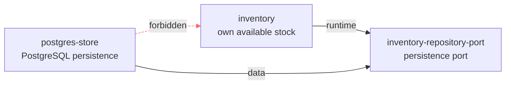

# Change report: invert-inventory-persistence-dependency

- **Language**: English (resolved from Brief prose — no `change-context.md` and no `working_language` set for this project)
- **Change status**: `active` (design-only; this sample has no `src/` — see "Out of scope" below)
- **Generated by**: `solidsdd-report` (a view only, not a source of truth)

## Status overview

| Section | Status | Main source / skill that would produce it |
|---------|--------|---------------------------------------------|
| 1. Demand and problem | Not performed | `solidsdd-intake` (`change-context.md` not created) |
| 2. Functional requirements | Present (partial) | `change-brief.json` (no Feature/Scenario linkage — `solidsdd-decompose` not run) |
| 3. Non-functional requirements | Present | `nfr.json` |
| 4. Technology selection | Not performed | `solidsdd-intake` (`change-context.md` §5 not created) |
| 5. Design — WorkPlan | Not performed | `solidsdd-decompose` |
| 5. Design — ArchitecturePlan | Present | `architecture-plan.json` (`status: changed`) + `architecture-reasoning.md` |
| 5. Design — ApplicationPlan | Not performed | `solidsdd-judge` |
| 5. Design — API contract | Not performed | no `openapi/openapi.yaml` or `graphql/schema.graphql` in this sample |
| 5. Design — DbC (OCL) | Not performed | no `contracts/**/*.ocl` in this sample |
| 5. Design — Formal | Not performed | no `formal/**` in this sample |
| 6. Key judgments and trade-offs | Present (partial) | `architecture-reasoning.md` + critique |
| 7. Open questions | Present | Brief has no `open_questions`; Context not created |

## 1. Demand and problem

Not performed — `change-context.md` does not exist for this change (produced by `solidsdd-intake`).

## 2. Functional requirements

### Goal

Let Inventory's persistence technology be swapped (or mocked in tests) without changing the Inventory domain module, by depending on an abstraction instead of a concrete store.

### In scope (`in_scope`)

- **R1** — Introduce `inventory_repository_port`; remove the direct `inventory -> postgres_store` dependency; add `inventory -> port` and `postgres_store -> port` instead
- **R2** — Add a `forbid_dependency` constraint so `postgres_store` cannot depend on `inventory` directly, only on the port

### Out of scope (`out_of_scope`)

- **X1** — Any implementation in `src/` — this whole example is a structural design artifact, not a runnable project
- **X2** — Introducing a second persistence adapter — one implementation (`PostgresInventoryStore`) is enough to demonstrate the inversion

### Success criteria

- **SC1** — ArchitecturePlan documents `inventory_repository_port`, the `inventory -> port` and `postgres_store -> port` dependencies, and the `postgres_store -> inventory` `forbid_dependency` constraint, and passes `solidsdd-lint` / `critique(architecture_plan)` cleanly

### Acceptance scenarios (Gherkin)

No Feature/Scenario is tied to this change (`solidsdd-decompose` not run for this design-only sample).

## 3. Non-functional requirements

| ID | Quality | Status | Requirement | Rationale | Threshold / verification |
|----|---------|--------|-------------|-----------|---------------------------|
| NFR1 | Reliability | out_of_scope | N/A | Design-only change; no runtime behavior introduced | — |
| NFR2 | Security | out_of_scope | N/A | Design-only change; no runtime behavior introduced | — |
| NFR3 | Performance | out_of_scope | N/A | Design-only change; no runtime behavior introduced | — |
| NFR4 | Operability | out_of_scope | N/A | Design-only change; no runtime behavior introduced | — |
| NFR5 | Compatibility | out_of_scope | N/A | Design-only change; no runtime behavior introduced | — |
| NFR6 | Maintainability | **in_scope** | Inventory must not depend on a concrete persistence technology; PostgresInventoryStore must not depend on Inventory directly | This is the whole point of the inversion: swapping or mocking persistence must not require changing the Inventory domain module | Threshold: 0 `forbid_dependency` violations for `postgres_store -> inventory` / Verification: `scripts/solidsdd-lint.sh` (Architecture Model validation) |

## 4. Technology selection

Not performed — `change-context.md` §5 does not exist (produced by `solidsdd-intake`).

## 5. Design

### WorkPlan — Not performed

This change has no `work-plan.json` (`solidsdd-decompose` not run). The structural design (ArchitecturePlan) stands on its own, ahead of any work decomposition.

### ArchitecturePlan — Present

`status: changed`. This change inverts the dependency established by the prior change in this sample, `establish-inventory-persistence`:

```text
Before:  Inventory -> PostgresInventoryStore
After:   Inventory -> InventoryRepositoryPort <- PostgresInventoryStore
```



**Modules**

| id | Responsibility | owns | public |
|----|-----------------|------|--------|
| `inventory` | Own available stock per SKU; expose stock read/adjust operations | `Stock` | `InventoryService` |
| `inventory-repository-port` | Persistence abstraction that Inventory depends on and infrastructure adapters implement | — | — |
| `postgres-store` | Concrete PostgreSQL persistence for inventory rows | — | — |

**Dependencies**

| from | to | reason | kind |
|------|----|--------|------|
| `inventory` | `inventory-repository-port` | Reads and writes stock through the persistence port | `runtime` |
| `postgres-store` | `inventory-repository-port` | Implements the persistence port with PostgreSQL | `data` |

**Structural constraints**

| type | from | to | reason |
|------|------|----|--------|
| `forbid_dependency` | `postgres-store` | `inventory` | Infrastructure must depend only on the persistence port, not directly on the Inventory domain module, so persistence implementations can be swapped without the domain knowing about them |

**Why** (from [architecture-reasoning.md](architecture-reasoning.md)): the port is modeled as its own top-level `softwareSystem`, a sibling of `inventory` — not nested inside it — because Structurizr forbids a relationship between a parent element and its own child. This was confirmed against the real Structurizr CLI while building this example and is now enforced by `scripts/solidsdd-architecture/validate.py` too.

**Critique (`architecture_plan`) — pass**

No findings. Dependency direction is genuinely reversed with a stated reason; the removed `inventory -> postgres_store` edge is not silently reintroduced (guarded by the new `forbid_dependency` constraint); the port correctly avoids a parent-child relationship.

Details: [architecture-plan.json](architecture-plan.json) / [critique-architecture-plan.json](critique-architecture-plan.json)

### ApplicationPlan — Not performed

No ApplicationPlan JSON found under `.solidsdd/changes/invert-inventory-persistence-dependency/` (`solidsdd-judge` not run). This change is structural design only; no API/DbC/formal specification-mechanism decision has been made.

### API contract — Not performed

This sample has no `openapi/openapi.yaml` or `graphql/schema.graphql` — it is a structural design artifact only.

### DbC (OCL) — Not performed

This sample has no `contracts/**/*.ocl`.

### Formal — Not performed

This sample has no `formal/**`. Technology selection itself was not performed (no Context), so no formal-method applicability judgment has been made either.

## 6. Key judgments and trade-offs

- Introduce `inventory_repository_port` as a sibling `softwareSystem` (not a nested `container`) so the port can be the target of relationships from both `inventory` and `postgres_store` without violating Structurizr's parent/child relationship rule.
- Add `forbid_dependency: postgres_store -> inventory` so the direct coupling removed by this change cannot silently reappear later.
- Accept one extra element (the port) and one extra hop for what is, in this minimal example, a single persistence technology — the trade-off is only worth taking when persistence swap/testability actually matters (see [architecture-reasoning.md](architecture-reasoning.md) "Trade-offs").
- Alternative considered and rejected: keeping the direct dependency and only adding tests against a real Postgres instance — rejected because it hides the coupling's cost rather than removing it.

## 7. Open questions

- ChangeBrief `open_questions`: (none)
- No `change-context.md` exists, so there are no Context §7 open questions to include.

## 8. Source artifacts

- `.solidsdd/changes/invert-inventory-persistence-dependency/status.json`
- `.solidsdd/changes/invert-inventory-persistence-dependency/change-brief.json`
- `.solidsdd/changes/invert-inventory-persistence-dependency/nfr.json`
- `.solidsdd/changes/invert-inventory-persistence-dependency/architecture-plan.json`
- `.solidsdd/changes/invert-inventory-persistence-dependency/architecture-reasoning.md`
- `.solidsdd/changes/invert-inventory-persistence-dependency/critique-architecture-plan.json`
- `.solidsdd/architecture/workspace.dsl` (persistent Architecture Model, this change's slice)
- `.solidsdd/architecture/invariants.yaml`
- `.solidsdd/changes/establish-inventory-persistence/` (prior change; the "Before" state this change inverts)
- change-context.md: (none → Not performed)
- work-plan.json: (none → Not performed)
- ApplicationPlan: (none → Not performed)
- OpenAPI / GraphQL / OCL / Formal: (none in this sample → Not performed)
