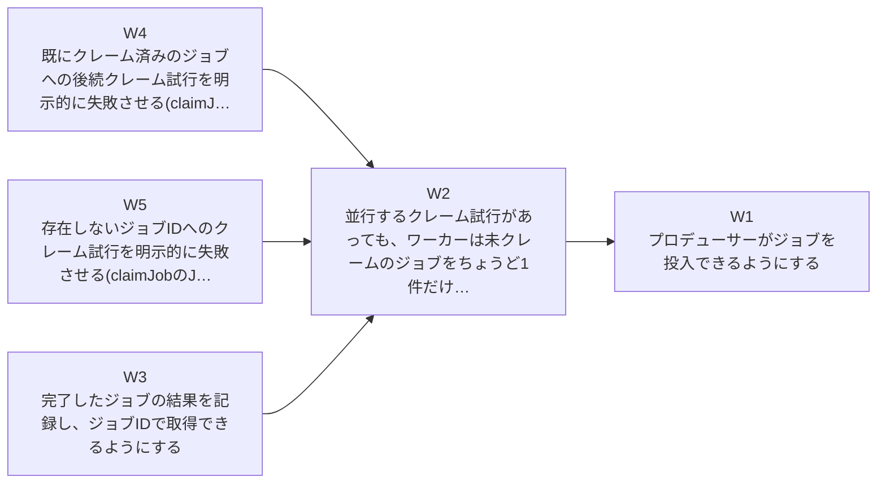
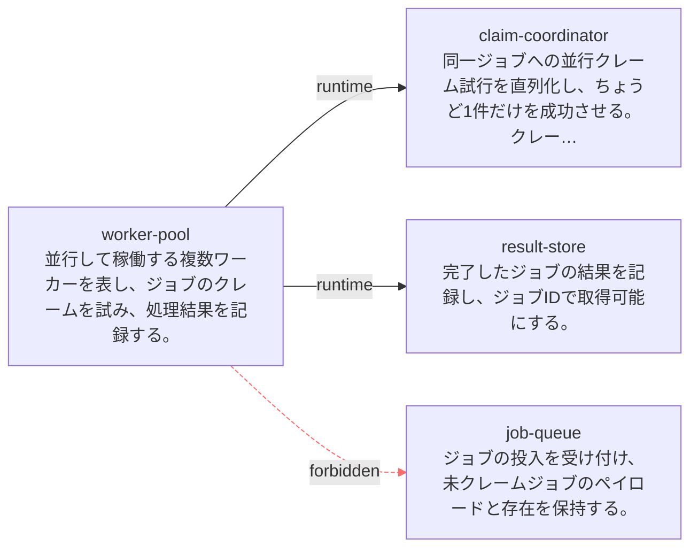
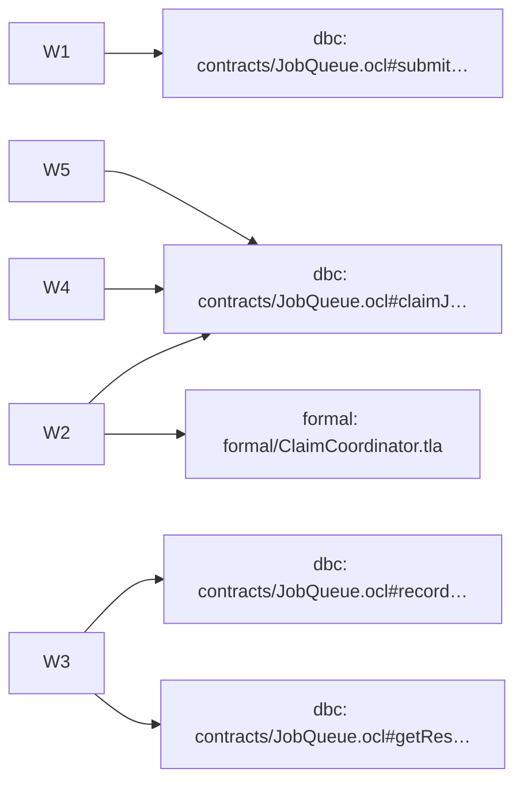

# Change report: establish-job-queue

## ステータス概要

| Section | Status | Owning skill |
| --- | --- | --- |
| 1. Demand and problem | 未実施 | solidsdd-intake |
| 2. Functional requirements | 実施済 | solidsdd-brief / solidsdd-decompose |
| 3. Non-functional requirements | 実施済 | solidsdd-intake |
| 4. Technology selection | 未実施 | solidsdd-intake |
| 5. Design — WorkPlan | 実施済 | solidsdd-decompose |
| 5. Design — ArchitecturePlan | 実施済 | solidsdd-architecture |
| 5. Design — ApplicationPlan | 実施済 | solidsdd-judge |
| 5. Design — API contract | 未実施 | solidsdd-apply-api |
| 5. Design — DbC | 実施済 | solidsdd-apply-dbc |
| 5. Design — Formal | 実施済 | solidsdd-apply-formal |
| 6. Key judgments and trade-offs | 未実施 | solidsdd-intake |
| 7. Open questions | 未実施 | — |

本changeはグリーンフィールドのジョブキューを新規に確立する。Architecture(Logical + Physical)、Gherkin、DbC(OCL)、Formal(TLA+)の4層すべてが揃っており、solidsdd-implement(実装)より前の段階で停止している。Architecture Modelはjob_queue(Job所有)・claim_coordinator(ClaimState所有、並行境界)・worker_pool・result_store(JobResult所有)の4モジュールから成り、claim_coordinatorについてはprocess/service/database boundaryが自明ではないためphysical-design.mdを作成し、共有ストアへのアトミックな条件付き更新でクレームの排他性を強制する設計判断を記録した。application-plan.jsonはclaimJob操作の契約を意図的に二分し、単発呼び出しの事前/事後条件はOCL(contracts/JobQueue.ocl)、並行する複数呼び出しにまたがる『成功するクレームは常にちょうど1件』という安全性はTLA+(formal/ClaimCoordinator.tla)がそれぞれ担当する。Architecture ModelとFormal applyの両方についてhuman_gateが立てられ、承認記録(gate-approvals/)を伴って進行した。

## 1. 需要と課題

未実施 (solidsdd-intake).

## 2. 機能要件

**In scope**

| id | text |
| --- | --- |
| R1 | プロデューサーはペイロードを持つ新しいジョブを投入できる |
| R2 | ワーカーは未クレームのジョブをちょうど1件だけクレームできる。異なるワーカーからの並行クレーム試行が同一ジョブに対して両方成功することは決してない |
| R3 | 完了したジョブの結果は記録され、ジョブIDで取得できる |

**Out of scope**

| id | text |
| --- | --- |
| X1 | ジョブのスケジューリング/優先度ポリシー(ワーカーがどのジョブをどの順で処理するかは本changeでは規定・保証しない) |
| X2 | 失敗したジョブのリトライ/デッドレター処理 |
| X3 | UIやダッシュボード |

**Success criteria**

| id | text |
| --- | --- |
| SC1 | Architecture Modelが、どのモジュールがキュー/ジョブ状態を所有し、並行クレーム試行がどこで直列化されるかを明示している |
| SC2 | 2人のワーカーが同一ジョブをクレームできない(希望として文書化するだけでなく、構造的に防止されている) |

**Scenarios**

```gherkin
  @R1
  Scenario: プロデューサーがジョブを投入する
    Given ジョブキューサービスが利用可能である
    When プロデューサーがペイロードを持つ新しいジョブを投入する
    Then ジョブは未クレーム状態で保存され、ジョブIDが割り当てられる
```

Source: [requirements/job-queue.feature](../../../requirements/job-queue.feature)

```gherkin
  @R2 @SC1 @SC2
  Scenario: 複数ワーカーが同一ジョブへ並行してクレームを試みても1人だけが成功する
    Given 未クレームのジョブが1件存在する
    And 2人のワーカーが同時にそのジョブのクレームを試みる
    When 両方のクレームリクエストが並行して処理される
    Then ちょうど1人のワーカーのクレームが成功する
    And もう1人のワーカーは「既にクレーム済み」という結果を受け取る
```

Source: [requirements/job-queue.feature](../../../requirements/job-queue.feature)

```gherkin
  @R2
  Scenario: 既にクレーム済みのジョブへのクレーム試行は失敗する
    Given ワーカーAがジョブのクレームに既に成功している
    When 別のワーカーBが同じジョブIDのクレームを試みる
    Then ワーカーBのクレームは失敗し、「既にクレーム済み」という結果を受け取る
    And ジョブのクレーム者はワーカーAのままである
```

Source: [requirements/job-queue.feature](../../../requirements/job-queue.feature)

```gherkin
  @R2
  Scenario: 存在しないジョブIDへのクレーム試行は失敗する
    Given 指定したジョブIDに対応するジョブがジョブキューに存在しない
    When ワーカーがそのジョブIDのクレームを試みる
    Then クレームは失敗し、「ジョブが見つからない」という結果を受け取る
```

Source: [requirements/job-queue.feature](../../../requirements/job-queue.feature)

```gherkin
  @R3
  Scenario: 完了したジョブの結果が記録され取得できる
    Given ワーカーがジョブのクレームに成功し処理を完了している
    When ワーカーが処理結果を記録する
    Then その結果はジョブIDで取得可能になる
```

Source: [requirements/job-queue.feature](../../../requirements/job-queue.feature)


**Coverage matrix**

| id | text | covered by | scenario |
| --- | --- | --- | --- |
| R1 | プロデューサーはペイロードを持つ新しいジョブを投入できる | W1 | プロデューサーがジョブを投入する |
| R2 | ワーカーは未クレームのジョブをちょうど1件だけクレームできる。異なるワーカーからの並行クレーム試行が同一ジョブに対して両方成功することは決してない | W2, W4, W5 | 複数ワーカーが同一ジョブへ並行してクレームを試みても1人だけが成功する, 既にクレーム済みのジョブへのクレーム試行は失敗する, 存在しないジョブIDへのクレーム試行は失敗する |
| R3 | 完了したジョブの結果は記録され、ジョブIDで取得できる | W3 | 完了したジョブの結果が記録され取得できる |
| SC1 | Architecture Modelが、どのモジュールがキュー/ジョブ状態を所有し、並行クレーム試行がどこで直列化されるかを明示している | W2 | 複数ワーカーが同一ジョブへ並行してクレームを試みても1人だけが成功する |
| SC2 | 2人のワーカーが同一ジョブをクレームできない(希望として文書化するだけでなく、構造的に防止されている) | W2 | 複数ワーカーが同一ジョブへ並行してクレームを試みても1人だけが成功する |

## 3. 非機能要件

| id | quality | status | requirement | threshold |
| --- | --- | --- | --- | --- |
| NFR1 | reliability | in_scope | 並行するワーカーが同一ジョブをクレームしようとしても、成功するクレームは常にちょうど1件である(二重クレームが発生しない) | 並行クレーム試行に対して二重成功が0件であること |
| NFR2 | maintainability | in_scope | ジョブの投入・クレーム・結果記録それぞれの単一操作としての事前条件・事後条件がドキュメント化され、機械的にレビュー可能である | 対象となる3操作すべてにOCLのpre/postが定義されている |
| NFR3 | security | out_of_scope | N/A | — |
| NFR4 | performance | out_of_scope | N/A | — |
| NFR5 | operability | out_of_scope | N/A | — |
| NFR6 | compatibility | out_of_scope | N/A | — |

## 4. 技術選定

未実施 (solidsdd-intake).

## 5. 設計

### WorkPlan



| id | intent | covers | scenario | status | depends_on |
| --- | --- | --- | --- | --- | --- |
| W1 | プロデューサーがジョブを投入できるようにする | R1 | プロデューサーがジョブを投入する | pending | — |
| W2 | 並行するクレーム試行があっても、ワーカーは未クレームのジョブをちょうど1件だけクレームできるようにする | R2, SC1, SC2 | 複数ワーカーが同一ジョブへ並行してクレームを試みても1人だけが成功する | pending | W1 |
| W4 | 既にクレーム済みのジョブへの後続クレーム試行を明示的に失敗させる(claimJobのJobNotAlreadyClaimed事前条件の失敗パスとしての単独検証) | R2 | 既にクレーム済みのジョブへのクレーム試行は失敗する | pending | W2 |
| W5 | 存在しないジョブIDへのクレーム試行を明示的に失敗させる(claimJobのJobIsRegistered事前条件の失敗パスとしての単独検証) | R2 | 存在しないジョブIDへのクレーム試行は失敗する | pending | W2 |
| W3 | 完了したジョブの結果を記録し、ジョブIDで取得できるようにする | R3 | 完了したジョブの結果が記録され取得できる | pending | W2 |

Source: [.solidsdd/changes/establish-job-queue/work-plan.json](../../../.solidsdd/changes/establish-job-queue/work-plan.json)

### ArchitecturePlan



**Modules**

| id | responsibility | owns | public |
| --- | --- | --- | --- |
| claim-coordinator | 同一ジョブへの並行クレーム試行を直列化し、ちょうど1件だけを成功させる。クレーム状態を所有する。 | ClaimState | ClaimJob |
| job-queue | ジョブの投入を受け付け、未クレームジョブのペイロードと存在を保持する。 | Job | SubmitJob |
| result-store | 完了したジョブの結果を記録し、ジョブIDで取得可能にする。 | JobResult | RecordResult, GetResult |
| worker-pool | 並行して稼働する複数ワーカーを表し、ジョブのクレームを試み、処理結果を記録する。 | — | — |

**Dependencies**

| from | to | reason | kind |
| --- | --- | --- | --- |
| worker-pool | claim-coordinator | ワーカーがジョブのクレームを試みる。並行クレームに対してちょうど1件だけが成功する。 | runtime |
| worker-pool | result-store | 処理完了後、結果をジョブIDで記録する。 | runtime |

**Constraints**

| type | from | to | reason |
| --- | --- | --- | --- |
| forbid_dependency | worker-pool | job-queue | ワーカーはJobQueueの投入サーフェスを直接呼び出してはならない。クレームは常に ClaimCoordinatorの排他的クレームサーフェスを経由しなければならない(R2/NFR1 の排他性要件)。 |

Source: [.solidsdd/changes/establish-job-queue/architecture-plan.json](../../../.solidsdd/changes/establish-job-queue/architecture-plan.json)

Why: [.solidsdd/changes/establish-job-queue/architecture-reasoning.md](../../../.solidsdd/changes/establish-job-queue/architecture-reasoning.md)

Physical design: [.solidsdd/changes/establish-job-queue/physical-design.md](../../../.solidsdd/changes/establish-job-queue/physical-design.md)

### ApplicationPlan



| kind | location | density | status | covers | rationale |
| --- | --- | --- | --- | --- | --- |
| dbc | contracts/JobQueue.ocl#submitJob | standard | apply | W1 | domain_contract: NFR2が「投入・クレーム・結果記録それぞれの単一操作としての事前条件・事後条件」をcontracts/JobQueue.ocl(measurement欄で明示)に要求しており、submitJobはその3操作の1つ。architecture_public_boundary: architecture-plan.jsonでjob-queueモジュールのpublic[]は["SubmitJob"]であり、公開サーフェスに該当する——ただしこのプロジェクトにHTTP/GraphQL層は存在しない(src/なし、設計のみのサンプル)ため、この軸は『apiへkindを切り替えよ』ではなく『dbcの厳密さを引き上げよ』と読み、kindはdbcのまま据え置く。additive_change: 新規グリーンフィールドの単一操作追加であり削除/破壊的変更を伴わないため、この軸単独ではhuman_gateを要求しない(judgment-axes.md combining rule 4)。post条件として「未クレーム状態で保存され、ジョブIDが割り当てられる」(W1受け入れ条件/R1)を第一級のOCL postとして表現する対象。 |
| dbc | contracts/JobQueue.ocl#claimJob | standard | apply | W2, W4, W5 | domain_contract: NFR2の3操作のうちclaimに相当し、単発呼び出しとしての事前条件(対象ジョブが存在し未クレーム——W4/W5がそれぞれの失敗パスを単独検証)と事後条件(成功時はクレーム状態に遷移、既にクレーム済みの場合は「既にクレーム済み」というnamed failureを返す——W2受け入れ条件の後半およびW4)を表現する。architecture_public_boundary: claim-coordinatorモジュールのpublic[]は["ClaimJob"]であり、worker-poolという別プロセス/別マシンでも動作しうる呼び出し元向けの唯一の公開サーフェス(physical-design.md)——このプロジェクトにapi技術が存在しないため、kindはdbcのまま据え置きつつdensityをstandardとする。重要な限定: OCLは単一呼び出しの事前/事後条件のみを表現でき、『並行する2つのクレーム試行のうち成功するのはちょうど1件』というインターリーブにまたがる安全性(concurrency_safety/NFR1/R2/SC1/SC2そのもの)は表現できないため、その責務は下記のformalターゲットに委譲し、ここでは持たせない(judgment-axes.mdの主要kind選定表でconcurrency_safetyはformalを優先)。 |
| formal | formal/ClaimCoordinator.tla | strict | apply | W2 | concurrency_safety: NFR1(「並行するワーカーが同一ジョブをクレームしようとしても、成功するクレームは常にちょうど1件である」)がW2/R2/SC1/SC2の核心であり、そのmeasurement欄が明示的に「formal/ClaimCoordinator.tla のTLC model checking」を指定している。Phase 3のformal apply vs defer条件(judgment-axes.md)を4つとも確認: (1) concurrency_safetyシグナルが存在する(NFR1本体)。(2) 形式アダプタとチェッカーがプロジェクト向けに文書化されている——リポジトリ直下tools/tla/(tla2tools.jar, fetch-tla2tools.sh)にTLC実行環境があり、かつformal/ClaimCoordinator.tlaという具体パスがnfr.json/architecture-reasoning.md/physical-design.md/requirements/job-queue.featureの4箇所で一貫して名指しされている——単なる一般論ではなくこのプロジェクト自身が採用を確定させている。(3) スコープは単一の共有資源/プロトコル(ClaimCoordinatorのクレーム状態遷移1つ)に限定されており「アプリ全体の形式化」ではない。(4) human_gate.required=trueを設定する(下記)。以上により status: apply、adapter_hint: tla、density: strictとする(NFR1が安全性クリティカルなプロパティであるため)。architecture-reasoning.mdのConcurrency Boundary/physical-design.mdの共有ストアへのアトミック条件付き更新という物理設計判断も、この形式モデルが検証すべき遷移プロパティの前提として整合する。 |
| dbc | contracts/JobQueue.ocl#recordResult | standard | apply | W3 | domain_contract: NFR2の3操作のうち結果記録に相当し、事前条件(対象ジョブがクレーム済みで処理が完了している)と事後条件(結果がジョブIDに紐づけて記録される——W3受け入れ条件/R3)を表現する。architecture_public_boundary: result-storeモジュールのpublic[]は["RecordResult", "GetResult"]の一つであり公開サーフェスに該当するが、api技術が存在しないためkindはdbcのまま据え置く。R3にはR2のような二重クレーム相当の排他性要件が明記されておらず(architecture-reasoning.md State Ownershipの通り)、concurrency_safetyシグナルは発火しないため、formalは不要でdbcのみで十分と判断する。 |
| dbc | contracts/JobQueue.ocl#getResult | standard | apply | W3 | domain_contract + architecture_public_boundary: result-storeモジュールのもう一つの公開操作GetResultは、R3の「ジョブIDで取得できる」という要求とSC1/SC2が求める検証可能性を支える読み取り側であり、NFR2が名指しする3操作(投入/クレーム/結果記録)には含まれないものの、公開サーフェスである以上、存在有無(記録済み/未記録)を明確にするpost条件を第一級のOCL契約として持たせる方が、実装フェーズでの曖昧さ(未記録時の挙動)を残さない。副作用を持たない単純な問い合わせ操作であり、複雑な事前条件やconcurrency_safetyの懸念はない。 |

Source: [.solidsdd/changes/establish-job-queue/application-plan.json](../../../.solidsdd/changes/establish-job-queue/application-plan.json)

### API contract

未実施 (solidsdd-apply-api).

### DbC (OCL)

contracts/JobQueue.ocl は4つの操作を対象とする: JobQueue::submitJob(ジョブ投入 — 未クレーム状態で保存されジョブIDが新規発行されることをpost条件として表現)、ClaimCoordinator::claimJob(単発呼び出しとしてのクレーム — 対象ジョブが存在し未クレームであることをpre条件とし、既にクレーム済みの場合は named failure に倒すことを意図し、成功時はクレーム状態への遷移をpost条件として表現)、ResultStore::recordResult(結果記録 — ResultStoreはJob/ClaimStateを所有しないためパラメータ妥当性のみをpreとし、結果がジョブIDに紐づいて記録されることをpostとする)、ResultStore::getResult(副作用のない問い合わせ — 記録済み/未記録それぞれの挙動を明示)。claimJobのOCLは意図的に『並行する2つのクレーム試行のうちちょうど1件だけが成功する』という複数呼び出しにまたがる安全性を表現していない — それはOCLの表現力の外にあり、formal/ClaimCoordinator.tlaの責務として明確に切り分けられている。

Source: [contracts/JobQueue.ocl](../../../contracts/JobQueue.ocl)

### Formal

formal/ClaimCoordinator.tla はClaimCoordinator::claimJobの並行安全性のみを対象とするPhase 3形式仕様である。状態はclaims(受理された<<worker, job>>のペアからなる追記のみのログ)の1変数のみ。Claim(w, j)アクションは『jがまだ誰にもクレームされていない』というガード条件のチェックと、claimsへの書き込みを単一の不可分なTLAステップとしてモデル化しており、これはphysical-design.mdが選んだ『共有ジョブストレージへのアトミックな条件付き更新(CAS相当)』という物理設計判断に対応する(専用の常駐コーディネータプロセスやロック変数は導入しない)。安全性不変条件AtMostOneClaimant(各ジョブについて、それをクレームしたワーカーの集合の要素数は常に1以下)がNFR1/R2/SC1/SC2の核心を直接formalizeしており、TLC model checkingで検証済み(3ワーカー×2ジョブの束縛、16個の異なる状態、エラーなし)。加えて全ジョブがクレームされた後は各ジョブがちょうど1人のクレーム者を持つことを確認するFinalOK、公平なスケジューリングの下で全ジョブが最終的にクレームされることを保証する生存性プロパティEventuallyAllJobsClaimedも検証されている。

Source: [formal/ClaimCoordinator.cfg](../../../formal/ClaimCoordinator.cfg)

Source: [formal/ClaimCoordinator.tla](../../../formal/ClaimCoordinator.tla)

## 6. 主要な判断とトレードオフ

未実施 (solidsdd-intake).

## 7. 未解決の課題

None recorded.

## 8. 参照アーティファクト

- [.solidsdd/changes/establish-job-queue/application-plan.json](../../../.solidsdd/changes/establish-job-queue/application-plan.json)
- [.solidsdd/changes/establish-job-queue/architecture-plan.json](../../../.solidsdd/changes/establish-job-queue/architecture-plan.json)
- [.solidsdd/changes/establish-job-queue/architecture-reasoning.md](../../../.solidsdd/changes/establish-job-queue/architecture-reasoning.md)
- [.solidsdd/changes/establish-job-queue/change-brief.json](../../../.solidsdd/changes/establish-job-queue/change-brief.json)
- [.solidsdd/changes/establish-job-queue/nfr.json](../../../.solidsdd/changes/establish-job-queue/nfr.json)
- [.solidsdd/changes/establish-job-queue/physical-design.md](../../../.solidsdd/changes/establish-job-queue/physical-design.md)
- [.solidsdd/changes/establish-job-queue/work-plan.json](../../../.solidsdd/changes/establish-job-queue/work-plan.json)
- [contracts/JobQueue.ocl](../../../contracts/JobQueue.ocl)
- [formal/ClaimCoordinator.cfg](../../../formal/ClaimCoordinator.cfg)
- [formal/ClaimCoordinator.tla](../../../formal/ClaimCoordinator.tla)
- [requirements/job-queue.feature](../../../requirements/job-queue.feature)
