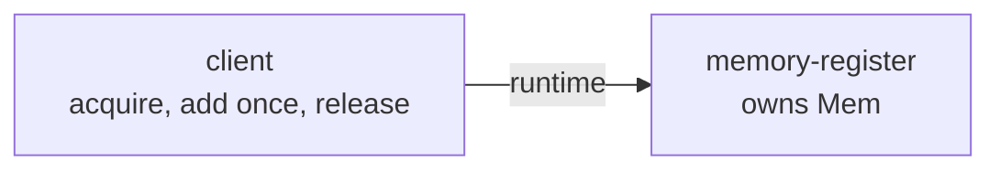
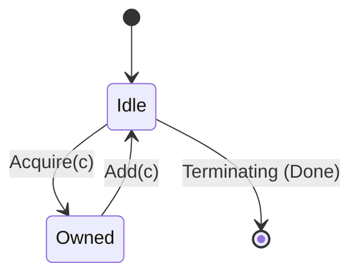

# Change report: establish-exclusive-memory-architecture

- **Language**: English (resolved from Brief prose — no `change-context.md` and no `working_language` set for this project)
- **Change status**: `active` (design-only; this sample has no `src/` — it is a Phase 3 formal-only reference)
- **Generated by**: `solidsdd-report` (a view only, not a source of truth)

## Status overview

| Section | Status | Main source / skill that would produce it |
|---------|--------|---------------------------------------------|
| 1. Demand and problem | Not performed | `solidsdd-intake` (`change-context.md` not created) |
| 2. Functional requirements | Present | `change-brief.json` + `requirements/exclusive-memory.feature` |
| 3. Non-functional requirements | Present | `nfr.json` |
| 4. Technology selection | Not performed | `solidsdd-intake` (`change-context.md` §5 not created) |
| 5. Design — WorkPlan | Not performed | `solidsdd-decompose` |
| 5. Design — ArchitecturePlan | Present | `architecture-plan.json` (`status: changed`) + `architecture-reasoning.md` |
| 5. Design — ApplicationPlan | Not performed | `solidsdd-judge` |
| 5. Design — API contract | Not performed | no `openapi/openapi.yaml` or `graphql/schema.graphql` in this sample |
| 5. Design — DbC (OCL) | Not performed | no `contracts/**/*.ocl` in this sample |
| 5. Design — Formal | Present | `formal/ExclusiveMemory.tla` + `formal/ExclusiveMemory.cfg` (unchanged by this change) |
| 6. Key judgments and trade-offs | Present | `architecture-reasoning.md` + critique |
| 7. Open questions | Present | Brief has no `open_questions`; Context not created |

## 1. Demand and problem

Not performed — `change-context.md` does not exist for this change (produced by `solidsdd-intake`).

## 2. Functional requirements

### Goal

Make explicit which module owns the shared register and enforces mutual exclusion, so the existing TLA+ model's properties are traceable to an architectural decision rather than only living in the `.tla` file.

### In scope (`in_scope`)

- **R1** — Define `memory_register` (owns `Mem`) and `client` as separate modules, with a `client -> memory_register` dependency
- **R2** — Record the state-ownership / mutual-exclusion Architecture Invariants that `formal/ExclusiveMemory.tla`'s `TypeOK`/`Inv` formalize

### Out of scope (`out_of_scope`)

- **X1** — Any change to `formal/ExclusiveMemory.tla` or `formal/ExclusiveMemory.cfg` — this change only adds the Architecture layer above the existing, unchanged formal model
- **X2** — Any implementation (this sample has no `src/`; it is a Phase 3 formal-only reference)

### Success criteria

- **SC1** — ArchitecturePlan documents `memory_register` / `client` responsibilities, state ownership, and the `client -> memory_register` dependency, and passes `solidsdd-lint` / `critique(architecture_plan)` cleanly
- **SC2** — `architecture-reasoning.md` explicitly connects Architecture (state ownership/boundary) to `requirements/exclusive-memory.feature` (BDD) and `formal/ExclusiveMemory.tla` (TLA+)

### Acceptance scenarios (Gherkin)

From [`requirements/exclusive-memory.feature`](../../../requirements/exclusive-memory.feature):

- **@R1** — *A single client adds to the register*: given `mem = 0`, a client acquires ownership, adds once, `mem` becomes `1`, then releases ownership.
- **@R2** — *Concurrent clients never lose an update*: given two clients each wanting to add multiple times, however they interleave acquire/add/release, `mem` ends up equal to the total adds performed, and at most one client holds ownership at any point in time.

(No WorkPlan exists for this design-only change, so there is no formal `covers` coverage matrix — these Scenarios are tied to the change via the Brief's SC2, not a WorkPlan item.)

## 3. Non-functional requirements

| ID | Quality | Status | Requirement | Rationale | Threshold / verification |
|----|---------|--------|-------------|-----------|---------------------------|
| NFR1 | Reliability | **in_scope** | The recorded state-ownership boundary must match what `formal/ExclusiveMemory.tla` actually checks (no drift between Architecture and the formal model) | The whole point of this change is to make the formal model's assumptions traceable to an architectural decision | Threshold: 1:1 correspondence, reviewed at change time / Verification: manual review that Architecture Invariants correspond to `TypeOK`/`Inv` |
| NFR2 | Security | out_of_scope | N/A | No security-relevant surface in this formal-only sample | — |
| NFR3 | Performance | out_of_scope | N/A | Bounded model checking only; no performance requirement | — |
| NFR4 | Operability | out_of_scope | N/A | No runtime deployment; design/formal artifact only | — |
| NFR5 | Compatibility | out_of_scope | N/A | Additive Architecture Model on top of an unchanged `.tla`/`.cfg` pair; nothing to break compatibility with | — |
| NFR6 | Maintainability | **in_scope** | Adding a module to the model later must not require touching `formal/ExclusiveMemory.tla` unless the new module actually mutates `Mem` | Keeps the Architecture layer and the formal layer independently evolvable, per the Role separation table | Threshold: 0 required `.tla` edits for architecture-only changes / Verification: `scripts/solidsdd-architecture.sh validate` |

## 4. Technology selection

Not performed — `change-context.md` §5 does not exist (produced by `solidsdd-intake`).

## 5. Design

### WorkPlan — Not performed

This change has no `work-plan.json` (`solidsdd-decompose` not run).

### ArchitecturePlan — Present

`status: changed`.

**Modules**

| id | Responsibility | owns | public |
|----|-----------------|------|--------|
| `client` | Acquire ownership of the register, add once, then release | — | — |
| `memory-register` | Own the shared memory register and its exclusive-ownership acquire/add/release protocol | `Mem` | `AcquireOwnership`, `AddAndRelease` |

**Dependencies**

| from | to | reason | kind |
|------|----|--------|------|
| `client` | `memory-register` | Acquires ownership, mutates mem, releases | `runtime` |

No `constraints[]` in this plan.

**Why** (from [architecture-reasoning.md](architecture-reasoning.md)): `memory_register`'s ownership protocol *is* the concurrency boundary — only the current owner may mutate `Mem`. `client -> memory_register` is the only direction that lets ownership stay centrally enforceable.

**Critique (`architecture_plan`) — pass**

No findings. Two modules with clear, non-overlapping responsibilities; the single dependency has a stated reason and the direction is the only one that keeps ownership centrally enforceable.

Details: [architecture-plan.json](architecture-plan.json) / [critique-architecture-plan.json](critique-architecture-plan.json)

### ApplicationPlan — Not performed

No ApplicationPlan JSON found under `.solidsdd/changes/establish-exclusive-memory-architecture/` (`solidsdd-judge` not run).

### API contract — Not performed

This sample has no `openapi/openapi.yaml` or `graphql/schema.graphql`.

### DbC (OCL) — Not performed

This sample has no `contracts/**/*.ocl`.

### Formal — Present

[`formal/ExclusiveMemory.tla`](../../../formal/ExclusiveMemory.tla) (+ [`formal/ExclusiveMemory.cfg`](../../../formal/ExclusiveMemory.cfg)) is **unchanged** by this change — this change only adds the Architecture layer above it (see out-of-scope X1).

`owner` is the mode-like variable driving the model's actions, so its two reachable "shapes" are shown as states below. This is a simplification for illustration, not a formal transcription — see the linked `.tla` file for the actual spec (`TypeOK`, `Inv`, `FinalOK`). Per-client remaining-add counts (`remaining[c]`) are not modeled as separate states; each client simply repeats Acquire → Add up to its own `MaxAdds` limit.

Checked properties: `TypeOK` (bounds on `mem`/`owner`/`remaining`), `FinalOK` (once all clients finish, `mem` equals the total planned adds). Run via `tools/tla/fetch-tla2tools.sh` then `./verify.sh` in this sample's directory.

## 6. Key judgments and trade-offs

- `MemoryRegister` owns `Mem`; no client mutates it directly — every mutation goes through the acquire/add/release surface, so ownership is centrally enforceable.
- `client -> memory_register` is the only dependency direction considered — the reverse would prevent central enforcement of ownership.
- Minimal two-module split, matching the goal of keeping this a small, focused sample; no further decomposition considered necessary.

## 7. Open questions

- ChangeBrief `open_questions`: (none)
- No `change-context.md` exists, so there are no Context §7 open questions to include.

## 8. Source artifacts

- `.solidsdd/changes/establish-exclusive-memory-architecture/status.json`
- `.solidsdd/changes/establish-exclusive-memory-architecture/change-brief.json`
- `.solidsdd/changes/establish-exclusive-memory-architecture/nfr.json`
- `.solidsdd/changes/establish-exclusive-memory-architecture/architecture-plan.json`
- `.solidsdd/changes/establish-exclusive-memory-architecture/architecture-reasoning.md`
- `.solidsdd/changes/establish-exclusive-memory-architecture/critique-architecture-plan.json`
- `.solidsdd/architecture/workspace.dsl`
- `.solidsdd/architecture/invariants.yaml`
- `requirements/exclusive-memory.feature`
- `formal/ExclusiveMemory.tla`, `formal/ExclusiveMemory.cfg` (unchanged by this change)
- change-context.md: (none → Not performed)
- work-plan.json: (none → Not performed)
- ApplicationPlan: (none → Not performed)
- OpenAPI / GraphQL / OCL: (none in this sample → Not performed)
