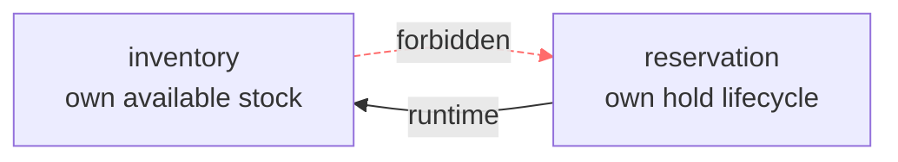
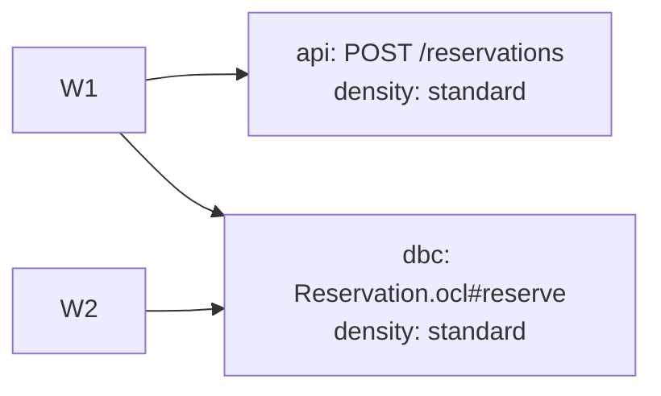
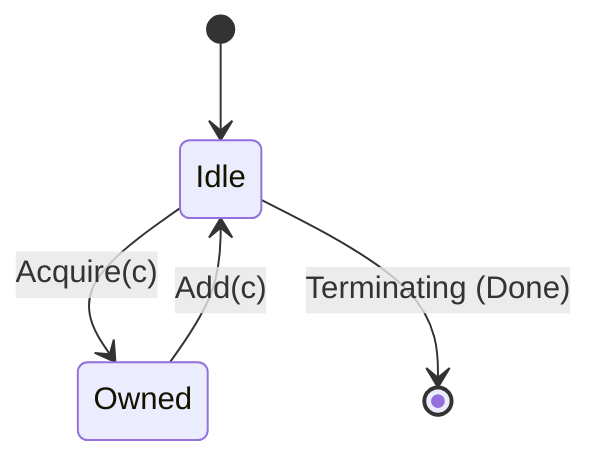

# Change report (solidsdd.report)

`solidsdd-report` reads existing change artifacts and emits a **human-readable** report for one change. It does **not** invent missing requirements, NFRs, tech choices, or design—sections without source artifacts are marked **not performed** (Japanese: **未実施**).

Manual skill only. Not part of `solidsdd-run` / `solidsdd-loop` automation. Orchestrators and human-gate stops may **suggest** running it so people can review framing and design so far.

## Role split

| Layer | Artifact | Report section |
|-------|----------|----------------|
| Framing | `change-context.md` | Demand, NFR, tech, judgments, open questions |
| Scope | `change-brief.json` | Functional requirements (scope lists) |
| Acceptance | `requirements/**/*.feature` | Functional requirements (scenarios) |
| Slice plan | `work-plan.json` | Design (work plan summary) |
| Structural design | ArchitecturePlan JSON | Design (modules / dependencies / ownership / constraints) |
| Apply judgment | ApplicationPlan JSON | Design (contract targets) |
| Contracts | OpenAPI / GraphQL / OCL / formal | Design (links + raw embed in HTML) |

The report is a **view**, not a new source of truth. Do not feed the report back as input that overrides Brief / contracts.

## Tooling (do this, not manual discovery)

`scripts/solidsdd-report.sh` — `collect` / `highlight` / `diagram` / `render`
(see [scripts/solidsdd-report/README.md](../scripts/solidsdd-report/README.md))
— does the mechanical work this document describes, so the agent doesn't
redo it by hand on every run:

1. **`collect`** resolves `change_id`, reads every artifact in the Role
   split table above, and returns one JSON blob: Present/Not-performed per
   section (the "Presence rules" table below), the Brief-id coverage
   matrix, verbatim Change Context section text, verbatim tied Gherkin
   Scenario blocks, and diagram eligibility + node/edge data (the
   "Diagrams" section below). Call this first.
2. **`render`** takes that data plus a small **narrative JSON** — only the
   handful of sections that need real LLM synthesis (API contract / DbC /
   Formal natural-language summaries, the status-overview paragraph, and,
   when applicable, a Formal state-diagram simplification) — and writes
   `report.md`/`report.html` **directly to disk**. `highlight` (raw
   contract/plan syntax coloring) and `diagram` (Mermaid + inline SVG) run
   inside `render`; call them standalone only if inspecting intermediate
   output.

Everything below this point documents *what those scripts compute and why*,
not a sequence of manual steps to repeat — read it to understand/validate
the tooling's output or to write the narrative JSON, not to hand-derive
presence, coverage, or diagrams yourself.

## Inputs

| Input | Default | Notes |
|-------|---------|-------|
| `change_id` | from `.solidsdd/active-change.json` | Caller override wins when a valid id is given |
| `format` | `markdown` | `html` optional (alone or in addition) |
| `language` | resolve per below | Caller override: `ja` / `en` (or equivalent); report-only |

### Resolving `change_id`

1. If the caller supplies `change_id`, use it (validate kebab-case; directory must exist under `.solidsdd/changes/`).
2. Else read `.solidsdd/active-change.json` → `change_id`.
3. If neither works, stop and ask for `change_id` (do not invent).

### Inferring report language

Follow [working-language.md](working-language.md):

1. Caller `language` override wins (**report only** — do not rewrite SoT artifacts).
2. Else `.solidsdd/config.yaml` → `working_language`.
3. Else Change Context §6 recorded language / dominant language of `change-context.md` (and Brief prose if context missing).
4. Else dominant language of the user request if clear; otherwise `en`.
5. Mixed sources: follow Change Context; keep quoted Gherkin/Scenario text as in the Feature files.
6. Status labels: Japanese → `未実施` / `実施済`; English → `Not performed` / `Present`.

## Output paths

| Format | Path |
|--------|------|
| Markdown (default) | `.solidsdd/changes/<change_id>/report.md` |
| HTML (optional) | `.solidsdd/changes/<change_id>/report.html` |

Overwrite previous reports for the same `change_id`. Do not write product-wide reports outside the change directory.

## Presence rules (required)

Computed by `collect` as `sections` — read `sections.<name>.state` directly
instead of re-deriving it from the artifacts by hand. The rules below are
what `collect` implements, kept here so the output is checkable and so
partial/legacy layouts that predate the tooling are still documented.

For each report section (and each design subsection), decide:

| State | When |
|-------|------|
| **Present** | The governing artifact exists and has usable content for that section |
| **Not performed** | Artifact missing, empty, or section not yet produced by the owning skill |

Rules:

- Never fabricate demand, NFRs, tech choices, WorkPlan items, ApplicationPlan targets, or contract bodies.
- When **Not performed**, write a short stub only (status + which skill produces it). No speculative bullets.
- Partial sections: show what exists; mark only the missing subsections as not performed (e.g. WorkPlan present, OpenAPI not performed).
- Cross-change Feature files may exist from prior changes—include Scenarios referenced by this change’s Brief / WorkPlan / Context §8 Links; if none of those exist yet, mark functional detail **Not performed** even if unrelated Features are on disk.

### Artifact → section map

| Report section | Present when |
|----------------|--------------|
| Demand and problem | `change-context.md` with §1 (and §2 when present) |
| Functional requirements | `change-brief.json` and/or Feature paths tied to this change |
| Non-functional requirements | `nfr.json` and/or `change-context.md` §4 with content |
| Technology selection | `change-context.md` §5 with content |
| Design — WorkPlan | `work-plan.json` |
| Design — ArchitecturePlan | `architecture-plan.json` for this change exists with `status: changed` (an existing file with `status: unchanged` is **Present** too, rendered as a one-line note, not Not performed) |
| Design — ApplicationPlan | One or more ApplicationPlan JSON files for this change (see discovery below) |
| Design — API contract | OpenAPI and/or GraphQL file exists at project defaults (or rule overrides) |
| Design — DbC (OCL) | At least one `contracts/**/*.ocl` (or project override) |
| Design — Formal | At least one `formal/**` spec when relevant; else omit or mark not performed |
| Key judgments | `change-context.md` §6 |
| Open questions | Always render; if no §7 / Brief `open_questions`, say none or not performed for the missing source |

### ApplicationPlan discovery

Implemented by `collect` (`artifacts.application_plans`). Look for (first match set wins; include all that clearly belong to this change):

- `.solidsdd/changes/<change_id>/items/*/application-plan.json` (**preferred**)
- `.solidsdd/changes/<change_id>/application-plan*.json`
- `.solidsdd/application-plan*.json` whose content/summary clearly ties to this `change_id` or its WorkPlan item ids (legacy)
- Paths listed in Context §8 Links

Also cite `run-state.json` in §8 Source artifacts when present (phase / item statuses).

If none found → Design — ApplicationPlan = **Not performed**.

### ArchitecturePlan discovery

Implemented by `collect` (`artifacts.architecture_plan`, `sections.design.architecture_plan`). Look for `.solidsdd/changes/<change_id>/architecture-plan.json` (change-level, not per-item — unlike ApplicationPlan; it is a **generated projection** of `.solidsdd/architecture/workspace.dsl` + `invariants.yaml`, not hand-authored). If missing → Design — ArchitecturePlan = **Not performed** (`solidsdd-architecture`). If present with `status: unchanged`, render as **Present** with a one-line "no structural change" note (do not treat it as Not performed — the judgment ran, it just found nothing to record) plus its `summary` when given. When `status: changed` and `.solidsdd/changes/<change_id>/architecture-reasoning.md` exists, link it alongside the ArchitecturePlan tables as the *why* behind the modules/dependencies/constraints shown (do not inline its full text — it is prose, not a table). When `.solidsdd/changes/<change_id>/physical-design.md` also exists (Architecture Depth Level 3 only), link it too as the Logical → Physical realization — do not inline its table; it is optional and most changes won't have one.

## Required document shape (Markdown)

Use these top-level headings. Translate heading text to the report language; keep the same order and numbering.

```markdown
# Change report: <change_id>

## Status overview
## 1. Demand and problem
## 2. Functional requirements
## 3. Non-functional requirements
## 4. Technology selection
## 5. Design
## 6. Key judgments and trade-offs
## 7. Open questions
## 8. Source artifacts
```

### Status overview

Table of sections → Present / Not performed (and skill that produces the missing piece).

### §1 Demand and problem

From Change Context §1–§2, copied **verbatim** by `render` (`artifacts.change_context_sections["1"|"2"].text`) — this is prose that already exists; it is not re-authored. If Context missing → entire section Not performed (`solidsdd-intake`).

### §2 Functional requirements

- From Brief: `goal`, `in_scope`, `out_of_scope`, `success_criteria` — render each scoped item as **`id` — `text`** (do not drop ids or concrete scope items). `render` builds this table mechanically from `change-brief.json`.
- From Features: Scenario names + tags (`@R1` …) + short Given/When/Then paraphrase or verbatim Scenario blocks; link to `feature_path`. `render` embeds the **verbatim** block `collect` already extracted (`artifacts.tied_scenarios[].gherkin`) — prefer that over an LLM paraphrase; it is exact and costs nothing to produce.
- **Coverage matrix** (when Brief + WorkPlan exist): table or list of Brief `R*` / `SC*` ids → WorkPlan item ids that `covers` them → Scenario name / tags. Mark uncovered ids explicitly (should already fail lint). Precomputed as `coverage_matrix` by `collect`.
- If Brief and Features both missing → Not performed (`solidsdd-brief` / `solidsdd-decompose`).

### §3–§4 NFR and technology

- Prefer `nfr.json` as SoT for §3 Non-functional requirements (render id / quality / status / requirement / threshold). Fall back to Context §4 only if `nfr.json` is missing (mark that SoT is absent). `render` builds the table from `nfr.json` mechanically, or copies Context §4 verbatim as a fallback.
- Technology: copy/adapt tables from Context §5 — `render` copies §5 **verbatim**, same reasoning as §1. Missing Context → Not performed.

### §5 Design

Subsections (omit a subsection only when not applicable to the stack **and** no plan asked for it; otherwise mark Not performed). WorkPlan / ArchitecturePlan / ApplicationPlan tables and diagrams are fully mechanical (`render` builds them from `collect`'s data with no narrative input); only API contract, DbC, and Formal need an agent-authored natural-language summary, supplied via the narrative JSON's `api_contract_summary` / `dbc_summary` / `formal_summary`:

1. **WorkPlan** — item id, intent, `covers`, scenario name, status, depends_on (table). Link to `work-plan.json`.
2. **ArchitecturePlan** — `status`; when `changed`: **a dependency diagram first** (see "Diagrams" below), then modules (id, responsibility, `owns`, `public`), dependencies (from, to, reason, kind), constraints (type, from, to, reason) as tables; when `unchanged`: one-line note + `summary`. Link to `architecture-plan.json`. When `physical-design.md` exists (Level 3 only), add a short **Physical Design** sub-note linking to it and naming the Logical → Physical realizations it records (one line per row is enough — do not reproduce its tables in the report).
3. **ApplicationPlan** — when the plan is large enough to benefit (see "Diagrams"), **a target-mapping diagram first**, then targets: kind, location, density, status, `covers` (WorkPlan ids), rationale (table). Link to plan JSON path(s).
4. **API contract** — natural-language summary of operations/types exposed; **Markdown: link only** to `openapi/openapi.yaml` or `graphql/schema.graphql` (no full YAML dump).
5. **DbC (OCL)** — natural-language summary of types/invariants/preconditions covered; **one bullet (or nested bullet) per operation / invariant**—do not pack many ops into a single unbroken sentence. **Markdown: link only** to each `.ocl` file.
6. **Formal** (optional) — when a spec has an identifiable state/mode variable (see "Diagrams"), **a state diagram first**, then summary + link to `formal/**`.

Do not paste full OpenAPI/OCL into Markdown.

### Diagrams

A picture is easier to scan than a table **only** when the underlying
artifact actually has graph or state-machine shape. Check each source
against the table below; do not add a diagram anywhere else (see
"Non-targets" at the end of this section) — a diagram is never a
substitute for the required tables, it goes **in addition to** them,
placed right after the one-line `status`/`summary` line and before the
tables (skim the picture, then read the detail).

For ArchitecturePlan / WorkPlan / ApplicationPlan, `collect` already applies
the eligibility row below as `diagrams.<kind>.eligible` and extracts the
node/edge data; `diagram` (invoked by `render`) builds the Mermaid source
and, when the optional Mermaid CLI (`mmdc`) is available, an inline SVG
rendered *by Mermaid itself* — node placement, edge routing, and label
placement are the renderer's job, not something to hand-compute or
threshold-check here. Formal is the one kind that still needs an agent
judgment call (identifying the mode variable from prose), passed to
`render` as `formal_state_diagram` in the narrative JSON.

| Source | Diagram kind | When |
|--------|--------------|------|
| ArchitecturePlan | dependency graph (`flowchart`) | `status: changed` and `modules[]` has ≥ 2 entries — always include |
| WorkPlan | dependency graph (`flowchart`) | ≥ 2 items and at least one `depends_on` edge — include; a WorkPlan with no `depends_on` edges at all is a flat list and doesn't need one |
| ApplicationPlan | target mapping (`flowchart`, bipartite) | ≥ 3 targets, or targets span ≥ 2 `kind`s — a plan with 1–2 targets of one kind is already fully readable as a table |
| Formal (TLA+ / Alloy) | state diagram (`stateDiagram-v2`) | The spec has an identifiable state/mode/owner-style variable with a small number of distinct values driving its actions — see below |

#### Dependency graphs (ArchitecturePlan, WorkPlan)

**Nodes**: one per module (ArchitecturePlan) or item id (WorkPlan), label =
`id` (+ a short responsibility/intent fragment when it fits).
**Edges**: solid, labelled with `kind` when present, for
`dependencies[]` / `depends_on`. Dashed **red**, labelled `forbidden`, for
`constraints[]` entries with `type: forbid_dependency`. Never render
`no_cycles` as an edge — it is a graph-wide rule, not a specific edge; note
it once in prose next to the diagram instead (e.g. "no dependency cycles
required among these modules").



#### Target mapping (ApplicationPlan)

Bipartite: left column = WorkPlan item ids the plan `covers` (or Brief scope
ids when a plan has no `covers`), right column = one node per **distinct**
`(kind, location)` pair, labelled with `kind` + a short location fragment +
`density`. Edge from each covering item to each target it maps to; no
edge styling needed (there is no "forbidden" concept here — `status: defer`
targets are simply labelled `(defer)` on the node instead of a distinct
edge style).



#### State diagrams (Formal: TLA+ / Alloy)

Formal specs are prose/math, not structured JSON — read the spec and
identify the **one** variable that most resembles a mode/status/owner
(e.g. `owner`, `status`, `phase` in the `.tla`/`.als` source). Treat its
small set of distinct values as states, and each action (operator that
appears in the `Next` disjunction, or Alloy predicate) that changes that
variable as a transition between the states it moves between. This is a
**simplification for illustration**, not a formal transcription — say so
in one caption line under the diagram, and always link the actual spec
file as the source of truth. Skip the diagram (keep prose + link only)
when no such single variable exists, or when the spec has more states
than fit legibly (roughly > 6).

Do not fold parameterized/per-process detail (e.g. a `remaining[c]`
function over multiple clients) into extra states — caption it instead
(e.g. "each client repeats Acquire → Add up to its own limit"). The
diagram shows the **shape** of the control flow, not the full formal
semantics.



#### Markdown rendering (all kinds)

Implemented by `diagram.py`'s `mermaid_*` functions — described here so the
output is checkable, not as manual steps. Emit a fenced ` ```mermaid ` block using the diagram kind's own syntax
(`flowchart LR` / `stateDiagram-v2`) — GitHub, GitLab, and most Markdown
viewers render these natively; they degrade to readable pseudo-diagram
text everywhere else, so no fallback image is needed. Sanitize node ids
for Mermaid (module/item ids may contain `-`; Mermaid node ids should
not — replace `-` with `_` for the node id, keep the original id in the
label text).

#### HTML rendering (all kinds)

Implemented by `diagram.py`'s `render_svg_via_mermaid_cli`, which renders
the Mermaid source above through the optional [Mermaid
CLI](https://github.com/mermaid-js/mermaid-cli) (`mmdc`) into an **inline
SVG**. This used to be a hand-computed layout (fixed box/arrow/label
coordinates); that repeatedly produced diagrams that were technically
non-overlapping but still hard to read — arrows crossing through boxes,
curve labels reading as attached to the wrong arrow, a label background
hiding the arrow underneath it. Node placement, edge routing, and label
placement without collisions is a genuinely hard layout problem, and
Mermaid's own renderer already solves it (the same renderer GitHub/GitLab
use to render the Markdown fallback above) — so let it, rather than
re-deriving that logic here.

`mmdc` renders with Mermaid's built-in `dark` theme (`-t dark`) and a
transparent background so the diagram reads correctly against this
document's dark navy page rather than clashing with Mermaid's light
default. `mmdc` is optional and requires a Chromium/Puppeteer runtime;
`diagram.py` looks for a `mmdc` binary on `PATH` first (a global install),
then falls back to `npx --offline @mermaid-js/mermaid-cli` (a project
devDependency install, without needing it on `PATH`) — `--offline` means
that fallback only ever uses an already-installed local/cached copy, never
a network fetch, so this stays offline-safe. When neither path can invoke
the tool, or the render fails for any reason (no browser runtime, timeout),
`diagram` returns `svg: null` and the caller keeps the Mermaid source only
— a complete, correct report either way, per the Markdown rendering rule
above (GitHub/GitLab/most viewers render `mermaid` fences natively).

**When the offline attempt yields no SVG and nicer inline diagrams are
worth it**, `render`/`diagram` accept `--allow-network`: this drops
`--offline` from the npx fallback (adding `--yes` so it installs
non-interactively instead of prompting) and raises the timeout to
accommodate a first-run npx install plus a Chromium/Puppeteer download.
Since `solidsdd-report` always runs with a human present (it's manual-only
— see "Execution" in SKILL.md), **ask the human before passing
`--allow-network`** rather than defaulting to it; only retry with it once
they've agreed to the one-time install. Never pass it from an unattended
context.

Put the rendered SVG in view by default, and the raw Mermaid source in a
`Diagram source` `<details>`/tab next to it (same tab/accordion mechanism as
Raw JSON below) so a reader can copy it into a Mermaid-aware tool.

#### Non-targets

Do not add a diagram for sections that are not graph- or state-shaped:
NFR table, Brief scope list, coverage matrix (Brief ids → WorkPlan items →
Scenario — already a clear table, a mapping diagram would just duplicate
it with less precision), OCL invariants, Gherkin Scenarios (Given/When/Then
is already a readable structured format — behavior belongs there per
[architecture-axes.md](architecture-axes.md)'s Role separation table; a
report diagram of it risks drifting from that source of truth instead of
just linking/quoting it), API contract endpoint lists (the OpenAPI/GraphQL
file itself, linked, is the right level of detail). When genuinely unsure
whether a section qualifies, prefer no diagram — a wrong or cluttered one
hurts understanding more than a good table does.

### §6–§7 Judgments and open questions

From Context §6–§7 and Brief `open_questions`. Deduplicate. `render` copies
Context §6/§7 **verbatim** and lists Brief `open_questions` mechanically —
no LLM authorship needed here either.

### §8 Source artifacts

Bullet list of paths actually read (Context, Brief, WorkPlan, Features, plans, contracts) — `source_artifacts` from `collect`, verbatim.

## HTML format (optional)

When `format` includes `html`, `render --format html` (or `both`) writes a
**self-contained** `report.html` itself — the agent does not hand-assemble
it. Requirements below describe what `render.py`'s `render_html` /
`highlight.py` implement; they're documentation of the output's shape, not
manual steps:

- Same section order and presence rules as Markdown.
- **Dark theme by default**: calm deep navy / near-black surfaces (`#070b14`–`#0f1626` range), **white or near-white body text** (`#ffffff` / light gray for secondary). Avoid loud yellow / chartreuse / neon monokai-style code backgrounds.
- **Syntax token contrast (required for Raw)**: keys and string/scalar values must be clearly distinguishable (e.g. cool cyan keys vs warm salmon strings). In Gherkin, keywords (`Feature` / `Scenario` / `Given` / `When` / `Then`) must contrast with step/title prose (near-white). `highlight.py`'s regex tokenizer (JSON / YAML / Gherkin / OCL / GraphQL) does this deterministically — no per-token LLM judgment, no Pygments/CDN dependency; its `TOKEN_CSS` is inlined once via `highlight --css-only`.
- **Natural language** is the default visible body for each design/contract block (the narrative JSON's summaries; see "Tooling" above).
- For OpenAPI, GraphQL, OCL, formal, and ApplicationPlan/WorkPlan raw JSON: a `<details class="raw">` accordion per file (pure CSS/HTML, no JS needed for this) so raw can be expanded without leaving the page.
- Embed raw file contents inside the HTML (escaped, highlighted). If a file is huge (> ~100KB, `highlight.py`'s `--max-bytes` default), embed a truncated head with a clear note and keep the repo path link.
- **Diagrams** (dependency graphs, target mappings, state diagrams — see "Diagrams" above): inline, generation-time SVG from `diagram.py` — no bundled/CDN JS library. Raw Mermaid source available alongside (in a `<details>`) for portability.
- The page remains fully usable offline / under `file://` — no network fetch of any kind.

Relative links from `.solidsdd/changes/<change_id>/report.html` to repo-root contracts must be correct (typically `../../../openapi/…`, `../../../contracts/…`).

A dependency diagram (see "Diagrams" above) sits inline, SVG first, source
in a `<details>`:

```html
<figure class="diagram">
  <svg viewBox="0 0 640 200" width="100%" role="img" aria-label="Module dependency diagram">
    <!-- nodes as rounded <rect> + <text>, solid arrows for dependencies,
         dashed red arrows labelled "forbidden" for forbid_dependency -->
  </svg>
  <details>
    <summary>Diagram source (Mermaid)</summary>
    <pre class="raw"><code>flowchart LR
  ...</code></pre>
  </details>
</figure>
```

## Constraints

- Read-only w.r.t. all solid_sdd sources except writing `report.md` / `report.html`
- No Change Context / Brief / WorkPlan / contract / implementation edits
- No critique, verify, or lifecycle status changes
- Prefer concise tables and bullets over essay PRD prose

## When to suggest this skill

After `solidsdd-intake` (and optional Change Context gate), after Brief, or before/after design-heavy phases—when a human needs a readable snapshot. Phrase as optional confirmation aid, not a blocking gate unless the project rule says otherwise.
